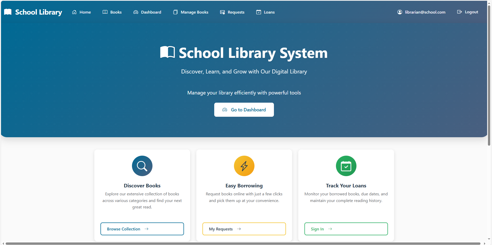
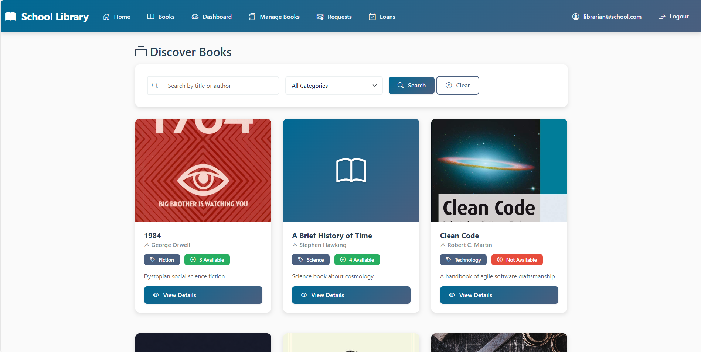
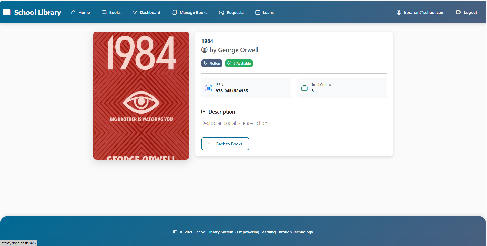
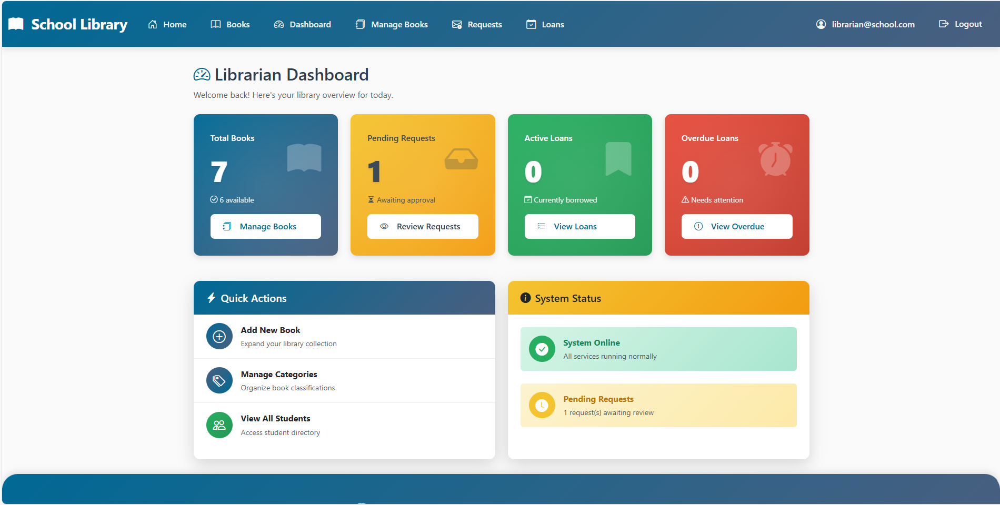
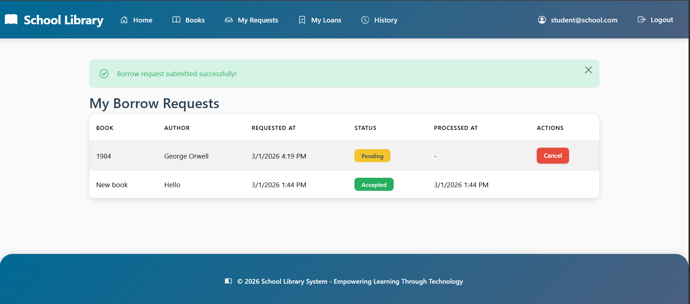

# Mini School Library System

## Overview

This project is a small role-based school book reservation web application built with **ASP.NET Core MVC**. It was created as a practical **GitHub Copilot** task where the goal was to generate the vast majority of the code with AI tools and act mainly as a reviewer.

The application supports two roles:

* **Student**
* **Librarian** (also acts as Admin)

Students can browse books, search/filter titles, submit borrow requests, track request statuses, view active loans, and review their loan history. Librarians can manage books, categories, requests, students, loans, and overdue records.

## Main Features

### Student Features

* View all books
* View book details
* Search and filter books
* Submit a borrow request for an available book
* View personal requests (`Pending`, `Accepted`, `Denied`, `Cancelled`)
* View active loans
* View returned loan history
* See due dates and overdue status
* Self-register and sign in

### Librarian / Admin Features

* View all books
* Create, edit, and delete books
* Manage categories
* View students
* Review borrow requests
* Accept or deny requests
* Manage loans
* Mark loans as returned
* View overdue loans

### Business Rules Enforced

* Stock decreases only when a librarian accepts a request
* Stock increases only when a loan is marked as returned
* Each accepted request creates a loan record
* Due date is always **7 days** after issue date
* Students cannot access librarian-only routes
* A student cannot have multiple pending requests at the same time
* A student cannot request the same book while already holding it
* Categories are reassigned to **Uncategorized** before deletion when needed

## Tech Stack

* **ASP.NET Core MVC** on **.NET 10**
* **Entity Framework Core**
* **ASP.NET Core Identity**
* **PostgreSQL**
* **Razor Views + Bootstrap**
* **GitHub Copilot - Claude Sonnet 4.5 (Agent Mode + Chat)**
* **ChatGPT 5.2 Thinking**

## AI-Assisted Development Workflow

This project was built with an AI-first workflow. My role was primarily to define requirements, review generated output, and apply minimal corrections when needed.

### Phase 1 - Planning with ChatGPT 5.2

I first used **ChatGPT 5.2 Thinking** to turn the raw project idea and feature list into a structured Markdown instruction file for GitHub Copilot Agent Mode.

Artifacts used:

* `copilot-instructions.md` - Copilot-ready implementation guide

#### Prompt 1

**Prompt:**
You are a senior full stack developer. Build a school book reservation web application with ASP.NET Core MVC. I have written the description, functionalities and other things related with this application below. Now, we are creating MD file for github copilot agent mode. After that description if you still have any questions for clarifying ask straightaway.

**GPT 5.2 Response:**
A few details still worth confirming before code generation:

Target framework: .NET 8?

Database: SQL Server or SQLite?

Should students self-register, or should only librarians create them?

Can a student have multiple pending requests for different books?

Can a student request the same book again while already holding it?

Should category deletion be blocked when books exist in that category?

Once you answer those, I can turn this into:

a stricter .github/copilot-instructions.md

#### Prompt 2

**Prompt:**
1. latest version 
2. PostgreSQL. ConnectionString: Host=localhost;Port=5432;Database=ECommerceDB;Username=postgres;Password=password 
3. self register 
4. no 
5. no 
6. no

In this phase:

* I described the application requirements
* Clarifying questions were answered (framework version, database, self-registration, request rules, category deletion behavior)
* The result was converted into a detailed implementation spec for Copilot

### Phase 2 - Project Generation with GitHub Copilot Agent Mode

After the planning phase, I used **GitHub Copilot Agent Mode** and provided the generated Markdown specification as the main implementation source.

Primary prompt/context:

* Use the `copilot-instructions.md` file as the implementation guide for the application

In this phase, Copilot Agent generated the core project structure, including:

* MVC structure
* models
* controllers
* views
* routing
* role-based logic
* database configuration
* business-rule-driven flows

### Phase 3 - Iterative Improvements with GitHub Copilot Chat

After the initial structure was generated, I used **GitHub Copilot Chat** in Visual Studio to iteratively improve the application.

#### Prompt 1

**Prompt:**
Build application using md file located in this location: `C:\Users\vusal\source\repos\BookReservation.github`

**Result summary:**
Copilot generated the base application from the Markdown specification.

#### Prompt 2

**Prompt:**
Implement image for books. And also modernize the UI of the application. It's so simple

**Result summary:**
Copilot added book images and improved the overall UI styling.

#### Prompt 3

**Prompt:**
Still there are some problems with UI. fix them. Place every item properly. UI should be looks good. The main colours of the application should be: ocen blue, dusky blue, golden yellow, off white

**Result summary:**
Copilot refined spacing, alignment, and styling while applying the requested color palette.

#### Prompt 4

**Prompt:**
Great now, only problem is footer's position. The footer is not positioned correctly. It should stay at the bottom of the page, but right now it appears too high and sometimes overlaps other content. Please fix the layout so the footer stays at the bottom without covering anything

**Result summary:**
Copilot attempted to correct the footer layout.

#### Prompt 5

**Prompt:**
still no, as you can see it's positioning in the middle of the page. Fix it to the proper place

**Result summary:**
Copilot made another footer layout attempt.

#### Prompt 6

**Prompt:**
You should make the position static for placing footer properly

**Result summary:**
Copilot updated footer positioning based on a more specific layout instruction.

#### Prompt 7

**Prompt:**
fix 'secure' section.

**Result summary:**
Copilot updated the problematic secure-related section.

#### Prompt 8

**Prompt:**
Implement pagination for required pages

**Result summary:**
Copilot added pagination support where needed.

## Primary AI Artifacts

### `copilot-instructions.md`

This file was the main specification given to GitHub Copilot Agent Mode. It defined:

* project goal
* tech stack
* fixed technical decisions
* roles and permissions
* domain models
* business rules
* required pages
* suggested controllers and services
* implementation order
* definition of done

This was the core planning artifact that made the generated output more structured and consistent.

## Tools / Models / MCP Used

### Tools and Models

* **ChatGPT 5.2 Thinking** - used to convert requirements into a detailed Copilot-ready Markdown specification
* **Claude Sonnet 4.5** - used for the main project generation based on the Markdown instruction file
* **GitHub Copilot Chat (Visual Studio)** - used for iterative UI, layout, footer, section, and pagination improvements
* **Visual Studio** - primary development environment

## Project Structure

A typical generated structure for this project includes:

* `Controllers/`
* `Models/`
* `Views/`
* `Data/`
* `Services/`
* `ViewModels/`
* `Areas/Librarian/Controllers/`
* `Areas/Librarian/Views/`
* `wwwroot/`

## How to Run

> Update these commands if your actual solution name or startup project differs.

### Prerequisites

* .NET 10 SDK
* PostgreSQL
* Visual Studio 2022 / later or Visual Studio Code

### Development Database

The original instruction file used this PostgreSQL connection string in development:

`Host=localhost;Port=5432;Database=LibraryDB;Username=postgres;Password=`

### Setup Steps

1. Clone the repository
2. Open the solution in Visual Studio
3. Update the connection string if needed
4. Apply migrations
5. Run the application

### Example Commands

1. Restore packages
   `dotnet restore`
2. Apply migrations
   `dotnet ef database update`
3. Run the app
   `dotnet run`

## AI Contribution Statement

This project was intentionally built with an AI-first workflow.

* The project specification was generated with **ChatGPT 5.2**
* The main application structure was generated with **GitHub Copilot Agent Mode**
* Additional refinements were generated with **GitHub Copilot Chat**
* My role was primarily to review generated output, validate functionality, and apply small corrections where needed

Based on the development process, the large majority of the code was AI-generated, while manual work focused on review, acceptance, testing, and minor fixes.

## What Worked Well

* Writing a strong first prompt had a major impact on the quality of the generated output
* Planning the architecture and requirements before implementation reduced rework later in the process
* Creating a detailed specification first produced better results than jumping directly into code generation
* Copilot Agent performed better when given a structured Markdown implementation guide
* Iterative prompting worked well for UI and refinement tasks
* Using English for technical AI chats felt more reliable and consistent in longer conversations; in my experience, non-English prompts sometimes seemed to lose context faster
* Specific prompts produced better results than broad “fix everything” prompts

## What Did Not Work Well

* Broad UI prompts improved appearance but did not always solve layout edge cases
* Footer positioning required multiple iterations before the result matched the intended behavior
* Some visual issues needed increasingly explicit instructions to get the desired output

## Prompting Insights and Recommendations

* Spend more time on the first prompt, because the initial instruction heavily influences the rest of the workflow
* Plan first, implement second; strong planning consistently produced better downstream results
* First generate architecture/specification, then generate implementation
* Use one main source-of-truth instruction file for Copilot Agent
* For longer technical sessions, using English prompts gave more stable results in my workflow
* For UI issues, describe both the problem and the expected end state
* For layout bugs, highly specific prompts are more effective than general polish requests
* Validate each generated step before moving to the next refinement pass

## Screenshots from some pages

- **Home Page**
  

- **Book List Page**
  

- **Book Details Page**
  

- **Librarian Dashboard**
  

- **Student's Borrowed Books**
  
